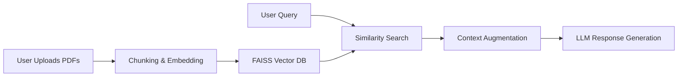

# LLM_RAG_CHATBOT

## Core Concept
A Retrieval-Augmented Generation (RAG) chatbot optimized for CPU deployment that answers user questions using both its pre-trained knowledge and context from user-uploaded documents. This project is a web application built with Streamlit, where users can upload PDF files and interact with an AI chatbot that can answer questions based on the content of those documents.

## Project Description
LLM Chatbot with Document Support is a smart chatbot that can answer questions using both its built-in knowledge and your own documents. I built it as a web app using Streamlit where you can upload PDF files and ask questions about them. The chatbot uses advanced AI technology (LLM) combined with a RAG system that searches through your documents to find relevant information and gives you accurate answers based on what you've uploaded.

## Project Structure
LLM-Chatbot-RAG-
|-> files/
|-> models/
|-> notebooks/
|   |-> RAG.ipynb
|-> src/
|   |-> pycache/
|   |-> app.py
|   |-> model.py
|   |-> rag_util.py
|-> .env
|-> .gitignore
|-> requirements.txt

### Components Explanation

-   **`files/`**: Stores user-uploaded PDF files. A `.gitkeep` file is included to ensure the directory is tracked by Git even when empty.
-   **`models/`**: Stores downloaded model weights and embeddings. A `.gitkeep` file is included to ensure the directory is tracked by Git even when empty.
-   **`notebooks/RAG.ipynb`**: A Jupyter notebook for step-by-step testing and development of the core RAG components, including document loading, text splitting, embedding creation, and inference.
-   **`src/`**: Contains the core application logic.
    -   **`app.py`**: The main Streamlit application file. It handles the user interface, including PDF uploads, chat interaction, and displaying chat messages. It orchestrates the calls to `model.py` and `rag_util.py`.
    -   **`model.py`**: Manages the LLM. It loads the `gemma-2b-it` model using `AutoTokenizer` and `AutoModelForCausalLM` from the `transformers` library, with CPU fallback support. It also handles prompt formatting and response generation.
    -   **`rag_util.py`**: Contains the Retrieval-Augmented Generation logic. It utilizes `PyPDFLoader` for reading PDFs, `TextSplitter` for chunking documents, `SentenceTransformers` for creating embeddings, and `FaissDb` for vector storage and similarity searches.
-   **`.env`**: A file to store environment variables, such as the Hugging Face `ACCESS_TOKEN`.
-   **`.gitignore`**: Specifies files and directories to be ignored by Git, preventing sensitive information (`.env`) and unnecessary files (`.pyc`, cache folders) from being committed.
-   **`requirements.txt`**: Lists all Python dependencies required to run the project, ensuring reproducibility. This includes libraries for the LLM (`transformers`, `torch`), PDF parsing (`pypdf`), RAG (`langchain`, `faiss-cpu`, `sentence-transformers`), and the web UI (`streamlit`).

## Workflow
1.  **User uploads PDFs** through the Streamlit sidebar.
2.  The uploaded PDFs are **saved locally** in the `/files` directory.
3.  **LangChain loads and splits** the documents into manageable chunks.
4.  **SentenceTransformer** encodes these text chunks into dense **vector embeddings**.
5.  **FAISS builds a searchable index** over these vectors, enabling fast similarity searches.
6.  The user asks a question, which triggers a **similarity search** on the FAISS index using the question's embedding.
7.  The **top-k matching chunks** from the documents are retrieved and used as **"context"**.
8.  The user's question and the retrieved context are **formatted into a prompt**.
9.  The `gemma-2b-it` model **generates a response** based on the prompt.
10. The final response is **displayed in the Streamlit chat window**.

## RAG Workflow Architecture



##  Setup and Installation

###  Prerequisites
- Python 3.8+
- Hugging Face account with [access token](https://huggingface.co/settings/tokens)

###  Install Dependencies
```bash
pip install -r requirements.txt
```

### Configure Environment
1. Create `.env` file in root directory  
2. Add your Hugging Face access token:  
```env
ACCESS_TOKEN="hf_xxxxxxxxxxxxxxxxxxxxxxxxxxxxxxxx"
```
Note: Replace hf_xxxxxxxxxxxxxxxxxxxxxxxxxxxxxxxx with your actual Hugging Face token

###  Run the Streamlit App
```bash
streamlit run src/app.py
```
The application will open in your web browser. You can now upload PDFs and start asking questions!
